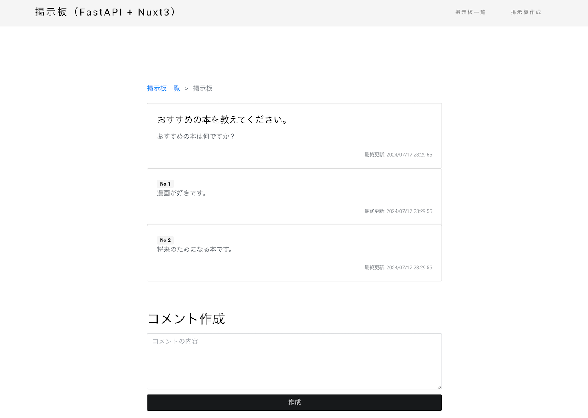
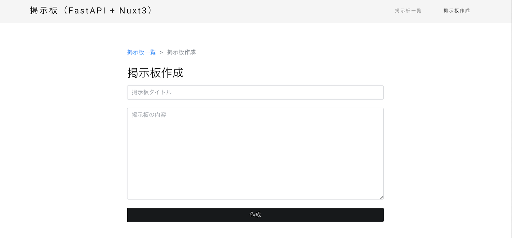

# ポートフォリオ用のNuxt3で作成した掲示板WEBサイト

## 概要

Nuxt3で作成した掲示板WEBサイトです。  
ローカル環境とDocker環境で実行可能です。

## 使用技術

- Nuxt3
- Vue3
- TypeScript
- Bootstrap5
- Docker

## デモ

## 動作確認方法

ローカル環境とDocker環境で動作確認可能です。  
掲示板の表示や作成を行う場合は、APIサーバーが必要です。

### ローカル環境

ローカル環境で動作確認する場合は、以下の手順で動作確認できます。  
Node.jsがインストールされていることを前提として説明します。

1. コマンドプロンプトを起動します。
2. プロジェクトフォルダの`src`ディレクトリに移動します。
3. `npm install`を実行して、パッケージをインストールします。
4. `npm run dev`を実行して、ローカル環境で実行します。
5. ブラウザで `http://localhost:3000` にアクセスして、掲示板を表示します。
6. 停止したい場合は、`Ctrl + C`を実行してください。

### Docker環境

Dockerを利用して実行する場合は、以下の手順で動作確認できます。  
Dockerがインストールされていることを前提として説明します。

1. コマンドプロンプトを起動します。
2. プロジェクトフォルダに移動します。
3. `./docker-compose-manager.sh start`を実行して、Dockerコンテナを起動します。
4. ブラウザで `http://localhost:3000` にアクセスして、掲示板を表示します。
5. 停止したい場合は、`./docker-compose-manager.sh stop`を実行してください。

`docker-compose-manager.sh`スクリプトを利用せず、`docker-compose up -d`コマンドを利用しても動作確認が可能です。

## 開発環境構築方法

VSCodeを利用してブレークポイントを設定して、デバッグすることが可能です。  
ローカル環境で動作する必要があるため、事前にローカル環境の動作確認を行ってください。  
ブレークポイントを設定する場合は、プロジェクトフォルダに移動して、VSCodeを起動してください。  
ブレークポイントを設定したら、デバッグ設定を`fullstack: nuxt`にして、デバッグを起動してください。  
